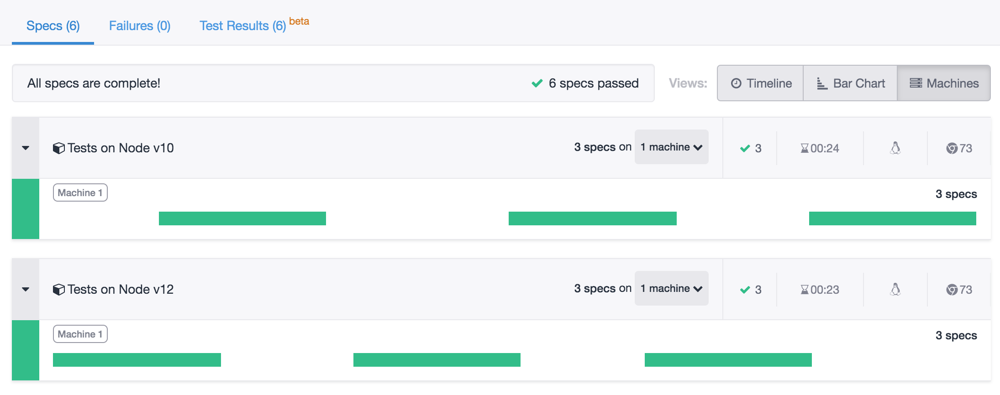
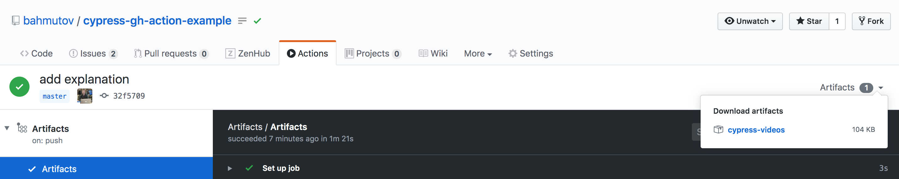

# cypress-gh-action-example [![renovate-app badge][renovate-badge]][renovate-app]
> Example running Cypress tests inside GitHub Action

Uses [cypress-io/github-action](https://github.com/cypress-io/github-action) to run [Cypress](https://www.cypress.io) end-to-end tests. Runs recorded at [Cypress Dashboard](https://dashboard.cypress.io/projects/yz8qku)

.github/workflows | Status | Description
--- | --- | ---
[basic.yml](.github/workflows/basic.yml) |  | Basic tests example
[tags.yml](.github/workflows/tags.yml) |  | Recorded runs with tags using different Node versions
[ubuntu.yml](.github/workflows/ubuntu.yml) |  | Runs E2E tests on Ubuntu 16 and Ubuntu 18
[artifacts.yml](.github/workflows/artifacts.yml) |  | Stores generated run video and any screenshots using CI artifacts
[chrome.yml](.github/workflows/chrome.yml) |  | Runs tests using Chrome browser, rather than Electron
[main.yml](.github/workflows/main.yml) |  | Runs tests on different versions of Node
[custom-container.yml](.github/workflows/custom-container.yml) |  | Runs tests using custom Docker image
[merge.yml](.github/workflows/merge.yml) |  | Shows how to set custom commit message for pull requests workflows

## Main

Example image of a test run across Node v10 and v12 recorded on Cypress Dashboard from the [.github/workflows/main.yml](.github/workflows/main.yml) workflow

**Note:** see [cypress.json](cypress.json) where Cypress is configured to use the system Node, rather than the bundled Node version.

## Artifacts

Example image showing how to download the test run videos from the action [.github/workflows/artifacts.yml](.github/workflows/artifacts.yml)

## More info

For more information see [cypress-io/github-action](https://github.com/cypress-io/github-action) and read [Drastically Simplify Testing on CI with Cypress GitHub Action](https://www.cypress.io/blog/2019/11/20/drastically-simplify-your-testing-with-cypress-github-action/) blog post.

[renovate-badge]: https://img.shields.io/badge/renovate-app-blue.svg
[renovate-app]: https://renovateapp.com/
